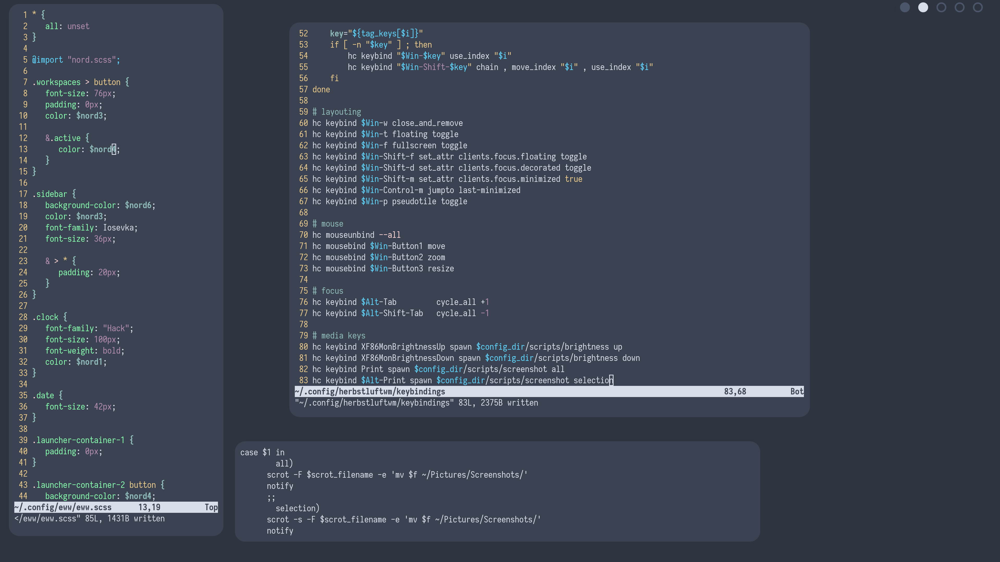

# Nordia

So I like [nord](https://www.nordtheme.com/). I made a minimalist desktop based on it.

I made this desktop with Artix using the Zen kernel. It was my first time using either of them and I ran into a lot of inconvenient things I had to fix. In my opinion, it would have been a lot easier to simply use Arch. Was it worth it to get to a computer without systemd? There isn't any noticeable difference in performance, as far as I can see. It's just to sort of know, I guess, that the software running it all is more better-designed. Worth it, no.
